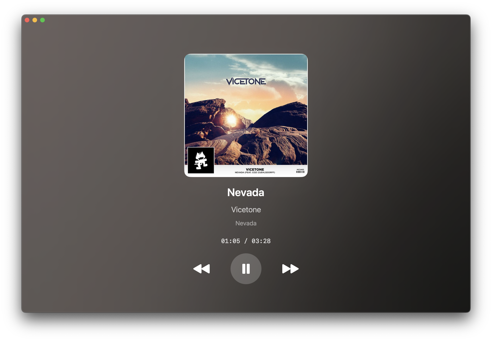

    
    <h1>Now Playing</h1>

A simple, beautiful "Now Playing" app for macOS that shows the currently playing song from all your favorite music players. Built entirely in SwiftUI.

## ✨ Features

- 📊 **Real Time Media Information**
- 🎨 **Stunning Visual Design**
- 🎵 **Two Playback Detection Modes**
- ⏯️ **Interactive Playback Controls**

> **Note:** Retrieving album art for Spotify requires an active internet connection.

> **Note:** Integration with Foobar2000 requires a [component](https://github.com/DD00031/foo-now-playing). 

## 🔊 Supported Players

### Music Player Mode
- **Apple Music** 
- **Spotify** 
- **Foobar2000** - Via component (see setup below)

### All Media Mode
Works with any app that uses macOS media controls:
- YouTube (Safari/Chrome/Firefox)
- VLC Media Player
- QuickTime Player
- Safari/Chrome audio
- And many more!

## 📦 Installation

**System Requirements:**  
- macOS **13 (Ventura)** or later  

Download the "Now-Playing.dmg" file from the [latest release](https://github.com/DD00031/Now-Playing/releases/latest). Open it and move the app into your `Applications` folder.

> [!IMPORTANT]
>
> Apple will flag this app as it is not signed by an registered developer, this doesn't mean the app is not safe. To use the app follow the steps below
> 1. Click **OK** to close the popup.
> 2. Open **System Settings** > **Privacy & Security**.
> 3. Scroll down and click **Open Anyway**.
> 4. Confirm your choice when prompted.
>
> You only need to do this once.

## ⚙️ Setup

### Basic Setup (Required)
On first launch, macOS will request permissions:

1. **Accessibility** - Required for media key controls
2. **Automation** (Apple Music) - Allow control of Music app
3. **Automation** (Spotify) - Allow control of Spotify app

Click **OK** for each prompt. The app will work immediately after granting these permissions.

### Foobar2000 Setup (Optional)
To use with Foobar2000:

1. Download and install the [Now Playing component](https://github.com/DD00031/foo-now-playing)
2. Configure the component in Foobar2000
3. Enable Foobar2000 in Now Playing settings

## 🎛️ Settings & Customization

### Appearance
- **Compact Mode** - Minimized text-only view
- **Dynamic Background** - Animated gradient animations
- **Progress Bar** - Toggle between progress bar and time display

### Data Source
- **Music Players** - Use specific integrations (default)
- **All Media** - Universal detection via MediaRemote (requires setup)

### Player Priority (Music Players Mode)
- Drag and drop to reorder priority
- Toggle individual players on/off
- First enabled player that's playing will be shown

## 📄 License

Now Playing is available under the GPL-3.0 license. See [LICENSE](LICENSE) for details.

## 🙏 Acknowledgments

Built with assistance from:
- Google Gemini 3.5 Pro
- Claude Sonnet 4.5

MediaRemote integration powered by:
- [mediaremote-adapter](https://github.com/ungive/mediaremote-adapter) by ungive

## ⚠️ Disclaimer

This project was built as a personal solution and learning experience. While functional and tested, it may not receive active maintenance. Issues and pull requests are welcome, but response times may vary.

---

    
Made with ❤️ for music lovers

    
If you enjoy this app, consider starring the repo! ⭐

